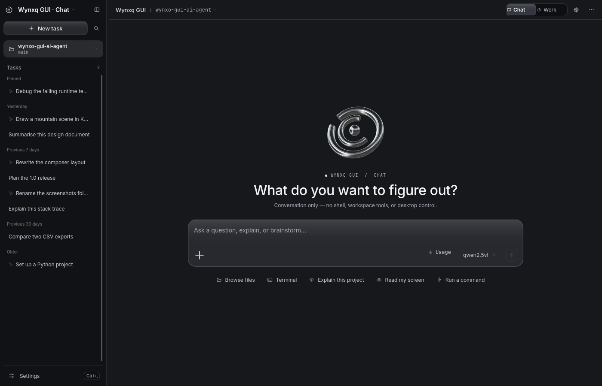
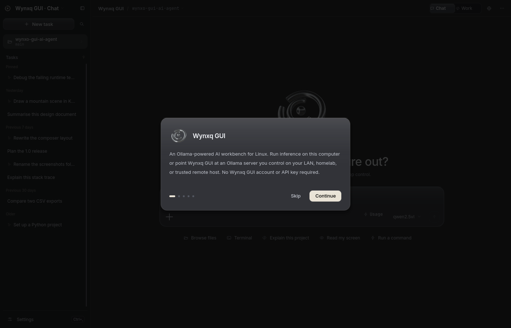

# Wynxq

**A local AI workbench for Linux, powered entirely by Ollama.**

Wynxq is a native Python + Qt Quick application. Choose the folder you are
working in, describe a task, and watch it run: a model on your own machine
answers, reads the files, folders and screenshots you attach, remembers what
you tell it from one task to the next, and — when you turn it on — sees your
screen and drives your mouse and keyboard.

Three columns: your tasks on the left, the conversation in the middle, and a
workspace dock on the right holding the tools the work actually needs — a file
tree and viewer, a real shell, the project's uncommitted changes and their
diffs, what the model can currently see, what it remembers between tasks, the
full run timeline, an embedded browser, and a preview.

No browser, no Node.js, no account, no API key, no cloud AI. Ollama does the
inference; Wynxq is the interface.



The graphite interface pairs a polished-metal edition of the Wynxq mark with
satin glass controls. The welcome sculpture reacts only to pointer movement;
there is no continuous animation competing with inference. Short windows hide
the sculpture to preserve room for the prompt. Reduced Motion disables its
movement, and floating surfaces retain an opaque fallback for readable text.

The first-run guide supports Back, optional project selection, and scrollable
explanations when the connection address or model name is long.

---

## Contents

- [What it does](#what-it-does)
- [Screenshots](#screenshots)
- [Requirements](#requirements)
- [Install](#install)
- [Connecting Ollama](#connecting-ollama)
- [Screen control](#screen-control)
- [Wayland and X11](#wayland-and-x11)
- [Keyboard](#keyboard)
- [Privacy](#privacy)
- [Development](#development)
- [Testing and screenshots](#testing-and-screenshots)
- [Update or remove](#update-or-remove)
- [Troubleshooting](#troubleshooting)

---

## What it does

**The workspace**
Three columns. Tasks, the project and search on the left. The conversation in
the middle, held to a reading measure rather than stretched to the window. The
workspace dock on the right, behind a permanent icon rail: `Ctrl+Shift+B`
opens and closes it, and each tool has its own key.

Both sides resize and remember where you left them. Below 1020px the dock
becomes a drawer; below 900px the sidebar does too. Nothing in the app moves
the panel you chose — the dock may suggest one before you have ever picked a
tab, and after that it stays where you put it.

**The workspace dock**

| Panel | What it is |
| --- | --- |
| **Files** | The project tree, lazily expanded and virtualised, with a filter, and a viewer below it — code with line numbers, images, or an honest refusal for a binary. It saves, and marks unsaved edits. |
| **Terminal** | A real PTY-backed shell in the project folder. `cd` persists, prompts appear, Ctrl+C reaches the foreground process, and ANSI colour survives. Command history on the arrow keys. |
| **Changes** | Uncommitted work read from Git, per file, with `+`/`−` counts and a unified diff. Discarding a file's changes asks first. |
| **Context** | Everything the model can currently see — the workspace, attachments, the open file, the browser page — with the context window meter. Removing something here removes the real thing. |
| **Memory** | What Wynxq remembers between tasks: `memory.md` itself, edited in place. Add a note, correct one, or forget the lot. |
| **Activity** | The whole session's run timeline: every step, its state, its timing, and its output when you open it. |
| **Browser** | An embedded Qt WebEngine view with address, back, forward, reload and open-externally. Only `http` and `https`; pop-ups and permission requests are refused. The page reaches the model only when you attach it. |
| **Preview** | Images and captures at full size. |

Files the agent touches appear as a dot in the tree, and the Changes panel
refreshes when a run finishes, so the dock reflects what just happened without
being asked.

**Conversation**
Streamed replies with real Markdown: headings, tables, quotes, lists and links
set in the app's own type scale. Fenced code becomes a card with syntax
highlighting, copy, and save. Reasoning from a thinking model collapses to a
single line — *Thought for 8.2s* — instead of burying the answer.

**Local context**
Attach files, folders, images, the clipboard, a whole screen, a screen region
you drag out, or the active window. Everything appears as a removable chip
above the composer — one place, never duplicated — so you always know exactly
what the model can see. Image chips open a preview. Drag and drop works too.
Capturing for context uses the screenshot path only; it never asks for control
of your input.

**Local copilot**
Ask “Open KCalc” or “Check my disk space”. A tool-capable model can discover
and launch installed apps, run Bash commands, inspect files and help with code
without screen-control permission. Commands return their output and exit code,
run in the selected workspace (or home folder), and stop on cancellation or
timeout. Output is capped at 32 KB; commands default to 60 seconds, with a
maximum of 300 seconds. There is no interactive stdin or automatic elevation.

**Screen control**
When enabled, a model with vision and tool calling can open applications,
click, type, scroll and drag. Every action appears inline with the task that
asked for it — one row each, with its state and duration, closing on a summary
line you can read in a second. The pointer travels rather than teleporting,
so you can see what it is about to do — and Escape stops it.

**Permission modes**
Local commands and screen actions share the selected approval mode, a ladder
from approving everything to approving nothing:

| Mode | Behaviour |
| --- | --- |
| Manual | Approve every command and desktop action before it runs |
| Auto-approve *(default)* | Open apps and click directly; approve commands, typing and key presses |
| Auto | Run unattended — but a command that could destroy data is still approved |
| Full access | Never ask, destructive commands included |

Reading the screen and moving the pointer never prompt — they change nothing.
Commands, typing and key chords can save, send or delete in whatever has focus, so they
stay behind a prompt until you choose Auto.

**Auto and Full access differ on one thing.** Auto reads the command before it
runs it, and a command that deletes files, repartitions a disk, pipes a download
into a shell, removes packages, elevates to another user, or throws away work in
Git is put in front of you anyway. Full access does not ask about anything, which
makes it a mode for a session you are watching rather than one you walk away
from. *Allow all in this task* follows the same rule: it stops the prompting for
the rest of the run, except for the things that cannot be undone.

**Chat is only chat.** A Chat task is not a Work task with its tools declined —
the model is never offered a shell, screen control or file access at all, so
there is nothing there to approve and nothing that can run by accident. It
answers, explains, plans and writes code as text, and says so plainly when a
request needs the machine. Work handles project files, commands, and desktop
control. The mode is chosen once per task and stays chosen.

**Memory**
One Markdown file, read at the start of every task. Tell Wynxq something once —
how you deploy, what the test command is, that you would rather have the command
first and the explanation after — and it is there in the next task, and the one
after that, in Chat and Work alike. The model saves and drops notes itself
through two tools; you can do the same by hand.

It is deliberately a file you own, not a table you cannot see: `memory.md` lives
beside the history database and the Memory panel (`Ctrl+Shift+M`) is that file,
edited in place. Notes are scoped — what is true everywhere is separate from what
is true only in one project, and a task only ever reads the global notes plus its
own project's, so one repository's conventions never leak into another's. Nothing
is remembered while the switch in **Settings → Agent → Memory** is off, and
*Forget everything* is one button with one confirmation.

**Models**
Browse what Ollama has installed with parameter size, quantisation, disk usage,
native context window and capabilities. Favourite the ones you use, download
new tags, delete old ones. Wynxq reads capabilities from Ollama rather than
guessing from names, and warns you *before* you send if the model cannot do
what you are asking — no vision for the image you attached, no tool calling for
the desktop task, or a conversation that has nearly filled the context window.

**The project**
The workspace folder is named in the sidebar and in the header, offered back to
you as a recent-projects list, and used as the default working directory for
commands and for the dock's terminal, so you do not have to repeat it every
turn. Its files, its shell and its uncommitted changes are all one keystroke
away in the dock; reveal it, open an external terminal in it, or copy its path
from the project menu.

**Quick bar**
A floating command bar (`Ctrl+Space`) that sits above other windows for a fast
question, a screen capture, or a jump back into the full app.

**Everything else**
Command palette, full-text task search, pin, rename, duplicate, branch from any
message, edit and resend, export to Markdown, speed presets, generation metrics
on the answer they describe, desktop notifications for long unattended runs, an
optional tray icon, a resizable sidebar that remembers where you left it, five
accent themes, a compact density, and a reduced-motion setting.

---

## Screenshots

Every image below is a real capture of the running Qt application, produced by
`python -m wynxq --snapshot` (see [Testing and screenshots](#testing-and-screenshots)).

| | |
| --- | --- |
| **A new task** — one question, then the openings<br> | **Files** — the project tree, and the file under it<br> |
| **Terminal** — a real shell, in the project folder<br> | **Changes** — every uncommitted file, and its diff<br> |
| **Browser** — a page beside the conversation<br> | **Context** — everything the model can see<br> |
| **Activity** — the whole run, not just the summary<br> | **Memory** — what carries from one task to the next<br> |
| **System** — measured, or absent<br> | **A desktop run** — every action, then one summary line<br> |
| **A coding run** — read, search, edit, then the command<br> | **Chat** — answers only, and it says so<br> |
| **Permission** — the exact command, and where it would run<br> | **Local context** — files, folders and captures as chips<br> |
| **Settings** — six sections, nothing repeated<br> | **Command palette** — every action, one keystroke away<br> |
| **Model** — switch and set the speed in one place<br> | **Model manager** — capabilities, size, favourites, downloads<br> |
| **Quick bar** — `Ctrl+Space`, above everything else<br> | **First run** — five steps, with Back and optional project setup<br> |

---

## Requirements

- Linux with a graphical session (Wayland or X11)
- Python 3.10 or newer, and Git
- [Ollama](https://docs.ollama.com/linux) running locally
- At least one local model — a vision + tools model for screen control

Git is used for the Changes panel as well as for installing; without a
repository that panel says so instead of guessing. The Browser panel needs Qt
WebEngine, which ships with PySide6 on most systems — where it is missing, the
panel explains itself and links still open in your system browser. Everything
else works without either.

---

## Install

```bash
git clone https://github.com/wynxo/wynxq-gui.git
cd wynxq-gui
python3 install.py
```

`./install` does the same thing. Then open **Wynxq** from your application menu,
or run `~/.local/bin/wynxq`.

The installer builds its own Python environment, installs dependencies, and
registers a launcher, an icon and a desktop entry. It copies the app, so the
checkout can be moved or deleted afterwards. It does not need `sudo`, touch
your system Python, start a background service, install Ollama, or download a
model. The first install needs internet access for the Python packages.

If Debian or Ubuntu reports missing `venv` support:

```bash
sudo apt install python3-venv
python3 install.py
```

---

## Connecting Ollama

1. Install [Ollama for Linux](https://docs.ollama.com/linux) if you have not already.
2. Make sure it is running. If it is not managed by a service, run `ollama serve`.
3. Open Wynxq. The default address is `http://127.0.0.1:11434`; change it under
   **Settings → General** if yours differs.
4. Pick a model in the model manager (`Ctrl+M`), or download one by tag.

What a model can do depends on the capabilities Ollama reports for it:

| Capability | What Wynxq can do |
| --- | --- |
| Chat | Stream answers and save conversations |
| Tools | Run local commands, work with files, discover and launch apps |
| Vision | Read screenshots and images you attach |
| Vision + tools | Full screen control: click, type, scroll, drag |
| Thinking | Show the model's reasoning before its answer |

A large text-only model cannot see a button or a canvas; Wynxq disables the
visual tools rather than letting the model guess where to click. Model size
alone does not determine these abilities. See Ollama's
[API introduction](https://docs.ollama.com/api/introduction) and
[tool calling documentation](https://docs.ollama.com/capabilities/tool-calling).

Only loopback addresses are accepted, `localhost` is resolved by Wynxq itself
rather than trusted to DNS, proxy environment variables are ignored, redirects
are refused, and models that forward to a remote host are rejected.

---

## Screen control

Start with something small:

> Open KolourPaint and draw a simple smiley face in the middle of a new canvas.

Turn it on first, under **Settings → Agent** — the one place it is switched.
The header says so while it is on. On Wayland, allow the screen-sharing and input
permissions your desktop asks for; Wynxq asks the portal to remember them, so a
desktop that supports session persistence will not ask again. Install the
application you want it to use first — Wynxq discovers apps through their
desktop entries. App launching works independently of screen control.

While it works, the actions appear inline with the task, each with its state
and duration. The pointer travels to where it is going rather than teleporting,
so you can follow it and interrupt it. Screenshots feed a vision model; pointer
motion and keyboard input affect your real desktop.

**Stopping.** Escape stops generation and desktop actions whenever Wynxq has
focus. While a model drives another window, Wynxq does not have focus — so it
also asks your desktop to bind a stop shortcut that works from anywhere, through
the GlobalShortcuts portal. Your compositor owns that binding and may choose a
different key from the one requested; whichever it assigns is shown under
**Settings → Agent**. On a desktop without that portal, screen control still
works and Escape in the Wynxq window still stops it.

Execution behavior:

- Screen control starts **off** every time Wynxq opens, remembered permission
  or not: persistence removes the prompt, never the switch.
- **Escape** stops generation and desktop actions from the Wynxq window, and a
  desktop-bound shortcut stops them from anywhere.
- Turning screen control off revokes input access at the backend, not just in
  the UI, even while an action is in flight.
- Every run has an action budget (20 by default); Wynxq stops and asks rather
  than running indefinitely.
- Commands use a dedicated Bash runner with captured output and process-group
  cancellation. They follow the selected approval mode. GUI applications use
  `gio` with their installed desktop entry.
- Regenerate is disabled for replies that ran tools, to avoid repeating actions
  accidentally; send a follow-up when you want another run.
- Screen text and tool results are treated as untrusted data, never as
  instructions.
- A permission prompt that times out, is dismissed, or is interrupted by
  Escape counts as a refusal.

An action that already happened is not undone by stopping.

---

## Wayland and X11

| Session | Backend | Notes |
| --- | --- | --- |
| KDE / GNOME Wayland | XDG RemoteDesktop, ScreenCast, Screenshot and GlobalShortcuts portals | Select every monitor; the compositor owns the permission dialog and the stop key |
| X11 | XTEST input, Pillow capture | Needs XTEST; typed characters must exist in the active keymap |
| No graphical session | Chat only | Input and capture are unavailable |

On Wayland, select every monitor in the permission dialog so Wynxq can map
screenshot pixels to the right input stream. It prefers the position metadata
the portal exposes, then monitor sizes, then the compositor's stable stream
order. Capturing the screen *for context* uses the Screenshot portal alone and
never asks for input control. Per-window capture is X11-only; Wayland
compositors do not expose it.

Two portal features are used where the desktop offers them, and skipped in
silence where it does not:

| Portal | What Wynxq asks for | Without it |
| --- | --- | --- |
| RemoteDesktop v2 `persist_mode` | Remember this permission, so screen control stops prompting on every launch | The compositor's dialog appears each time, as before |
| GlobalShortcuts | One shortcut that stops a run while another window has focus | Escape still stops it from the Wynxq window |

The restore token the portal issues is single use: Wynxq stores the new one
after every session and discards it if the portal ever refuses to restore it,
so a stale token cannot leave screen control permanently broken.

On Debian KDE:

```bash
sudo apt install xdg-desktop-portal xdg-desktop-portal-kde libglib2.0-bin
```

Use the matching portal backend on other desktops. `libglib2.0-bin` provides
`gio`, which launches applications. Wayland support still needs testing on your
specific compositor and version.

---

## Keyboard

| Shortcut | Action |
| --- | --- |
| Enter / Shift+Enter | Send / new line |
| Escape | Stop generation and desktop actions (from the Wynxq window) |
| Ctrl+N | New task |
| Ctrl+K | Search tasks |
| Ctrl+Shift+P | Command palette |
| Ctrl+Space | Quick bar |
| Ctrl+M | Model manager |
| Ctrl+B | Show or hide the sidebar |
| Ctrl+R | Regenerate |
| Ctrl+D | Duplicate task |
| Alt+Up / Alt+Down | Previous / next task |
| Ctrl+Shift+V | Paste an image as context |
| Ctrl+, | Settings |

The workspace dock:

| Shortcut | Action |
| --- | --- |
| Ctrl+Shift+B | Show or hide the dock panel |
| Ctrl+Shift+E | Files |
| Ctrl+` | Terminal |
| Ctrl+Shift+G | Changes |
| Ctrl+Shift+K | Context |
| Ctrl+Shift+M | Memory |
| Ctrl+Shift+A | Activity |
| Ctrl+Shift+W | Browser |
| Ctrl+Shift+U | Preview |
| Ctrl+L | Focus the address bar, while Browser is open |

The same list is in the app under **Keyboard**, from the command palette or the
overflow menu. These are window shortcuts, active while Wynxq has keyboard focus. Linux gives
applications no portable way to claim a system-wide hotkey, so for a real
global quick bar, bind your desktop's custom shortcut to:

```
wynxq --quick
```

A running Wynxq picks that up over a local socket and raises the bar; if none is
running, it starts one.

---

## Accessibility

Every text colour in the palette meets WCAG AA (4.5:1) against every surface it
is used on, and a test asserts it — including all five accent themes, the
syntax palette, and the ink chosen for text on the accent. Status is never
carried by colour alone: activity rows pair a colour with an icon, a word and a
pulse. Controls stay at least 32 px in compact density, focus rings are drawn
on buttons and fields, and **Reduce motion** under Settings → Appearance turns
off every transition and looping animation rather than just shortening them.

---

## Privacy

- Inference runs through your local Ollama server. Nothing is sent anywhere else.
- Conversations live in a private SQLite file at
  `~/.local/share/wynxq/history.sqlite3` (or `$XDG_DATA_HOME/wynxq`), created
  with `0600` permissions.
- Long-term memory is one Markdown file beside it, `~/.local/share/wynxq/memory.md`,
  also `0600`. It is read into every task and never leaves your machine. Wynxq is
  told not to save secrets or credentials there; read it, edit it and empty it
  yourself in the Memory panel, and turn it off entirely in Settings → Agent.
- Screenshots go to your local model and are **not** written into task history.
  The Wayland portal may create its own temporary capture files.
- No account, no API key, no telemetry, no hosted backend.

---

## Development

```bash
python3 -m venv .venv
.venv/bin/python -m pip install -e . pytest
.venv/bin/python -m wynxq
.venv/bin/python -m pytest -q
```

Layout:

| Path | Responsibility |
| --- | --- |
| `wynxq/ui/Main.qml` | The application shell: three columns, shortcuts, overlays |
| `wynxq/ui/Wynxq/` | The QML module — `Theme.qml` plus ~55 components |
| `wynxq/controller.py` | Qt bridge; owns conversation, Ollama, task and desktop state |
| `wynxq/dock.py` | The workspace dock: tab state, file tree, terminal view, changes, context, activity, browser |
| `wynxq/project_files.py` | The file tree, the viewer's reader and writer, and path containment |
| `wynxq/terminal.py` | PTY shell sessions and the ANSI screen |
| `wynxq/diffs.py` | Git status, line counts, unified diffs, reverting |
| `wynxq/activity.py` | The run timeline and its state vocabulary |
| `wynxq/browser.py` | Embedded-browser policy: availability, URL rules, page context |
| `wynxq/system.py` | Measured runtime state for the System panel |
| `wynxq/commands.py` | Local Bash execution, bounded output, timeout and cancellation |
| `wynxq/engine.py` | Ollama transport and the bounded desktop tool loop |
| `wynxq/desktop.py` | Wayland portal and X11 backends |
| `wynxq/markdown.py` | Message segmentation, highlighting, Markdown rendering |
| `wynxq/context.py` | Composer attachments |
| `wynxq/storage.py` | SQLite history and settings |
| `wynxq/notify.py` | Desktop notifications and system integration |
| `wynxq/demo.py` | Fixed state for previews and screenshots |

The dock is deliberately not part of `controller.py`: the controller owns the
conversation, the dock owns the tools, and they meet at a handful of calls —
the project folder, the run timeline, and the attachment list.

`Theme.qml` is the only place colour, spacing, radius, type and motion are
defined; a test fails the build if a component hard-codes a colour. The
installer uses only the standard library, so it runs before dependencies exist.

---

## Testing and screenshots

```bash
.venv/bin/python -m pytest -q
QT_QPA_PLATFORM=offscreen QT_QUICK_BACKEND=software .venv/bin/python -m wynxq --smoke-test
```

The conversation interaction checks drive the real scrollbar, keyboard copy,
message recycling, and a 560 × 520 window with a long draft and 12 attachments:

```bash
WYNXQ_QML_SMOKE=1 .venv/bin/python -m pytest -q tests/test_conversation_stability.py
```

The [constrained composer](docs/screenshots/constrained-composer.png) and
[long-command review](docs/screenshots/permission-review.png) captures show these
states. To refresh them, run `tests/conversation_stability_probe.py` with
`QT_QPA_PLATFORM=offscreen`, `QT_QUICK_BACKEND=software`, and
`WYNXQ_STABILITY_SCREENSHOTS=docs/screenshots`.

To see the interface without any real history, Ollama, or desktop access:

```bash
.venv/bin/python -m wynxq --ui-preview              # a task with an answer
.venv/bin/python -m wynxq --ui-preview empty        # a new task
.venv/bin/python -m wynxq --ui-preview context      # attachments
.venv/bin/python -m wynxq --ui-preview run          # a finished agent run
.venv/bin/python -m wynxq --ui-preview desktop      # mid-run, waiting for approval
.venv/bin/python -m wynxq --ui-preview welcome      # first run
.venv/bin/python -m wynxq --ui-preview dock-files      # the file tree and viewer
.venv/bin/python -m wynxq --ui-preview dock-terminal   # a live shell
.venv/bin/python -m wynxq --ui-preview dock-changes    # Git changes and a diff
.venv/bin/python -m wynxq --ui-preview dock-browser    # the embedded browser
.venv/bin/python -m wynxq --ui-preview dock-context    # what the model can see
.venv/bin/python -m wynxq --ui-preview dock-memory     # what carries between tasks
.venv/bin/python -m wynxq --ui-preview dock-activity   # the run timeline
.venv/bin/python -m wynxq --ui-preview work-run        # a coding turn, start to finish
```

The dock scenes point at this checkout, so Files, Changes and Terminal show a
real tree, a real diff and a real shell rather than invented rows.

To regenerate the demo scenes in `docs/screenshots/` — real captures of the
real renderer, never mock-ups:

```bash
xvfb-run -a -s "-screen 0 1600x1000x24" \
  .venv/bin/python -m wynxq --snapshot docs/screenshots
```

Add `--size 980x760` to check a narrower layout. CI runs the same command and
uploads the results as a build artifact.

Tests cover a full turn streamed from a real local HTTP server through the real
controller into the message model, desktop action validation with test
backends, permission modes and the approval gate, message segmentation and
rendering, attachments and region cropping, conversation storage and search,
install/uninstall transactions, and the workspace dock: path containment for
the file tree and viewer, a real PTY shell (`cd` persistence, interrupt, ANSI
parsing), Git status and diff parsing against a real repository, the URL rules
the browser will and will not open, and the dock's own state rules. They do not establish end-to-end reliability of an arbitrary
model or compositor — a real screenshot → model → drawing task still depends on
your installed model, your Ollama server, the target application, and your
desktop's permissions.

---

## Update or remove

```bash
git pull
python3 install.py
```

An upgrade builds a new environment before switching the active release, so a
failed install leaves the previous version working. Restart Wynxq to use an
update.

```bash
~/.local/bin/wynxq --uninstall            # keeps conversations and settings
~/.local/bin/wynxq --uninstall --purge    # removes them too
```

Uninstall never removes Ollama or your downloaded models. Modified launchers,
modified desktop entries, unknown files and user-data symlinks are preserved
and reported.

| Item | Location |
| --- | --- |
| App and isolated environments | `$XDG_DATA_HOME/wynxq-app` (default `~/.local/share/wynxq-app`) |
| Launcher | `~/.local/bin/wynxq` |
| Desktop entry | `$XDG_DATA_HOME/applications/io.github.wynxq.Wynxq.desktop` |
| Icon | `$XDG_DATA_HOME/icons/hicolor/scalable/apps/io.github.wynxq.Wynxq.svg` |
| Conversations and settings | `$XDG_DATA_HOME/wynxq/history.sqlite3` |

Advanced: `python3 install.py --install-root /path --bin-dir /path`. Pass the
same install root to `uninstall.py`, or use that installation's launcher.

---

## Troubleshooting

**Ollama is not responding.** Check `ollama list` and
`curl http://127.0.0.1:11434/api/tags`. The Settings address is the server
origin, without `/api`. If Ollama already runs as a service, do not start a
second one on the same port.

**A model tag cannot be found.** Use a tag from `ollama list` or the Ollama
library. A failed download leaves your existing models alone.

**Qt cannot load the xcb plugin.** A minimal desktop may need:

```bash
sudo apt install libxcb-cursor0 libxkbcommon-x11-0 libegl1 libgl1
```

Run the launcher from a terminal to see the missing-library diagnostics.
Package names vary by distribution; see
[Qt's Linux requirements](https://doc.qt.io/qt-6/linux-requirements.html).

**Rendering looks wrong.** Try `QT_QUICK_BACKEND=software ~/.local/bin/wynxq`.
Reduced motion is also available under Settings → Appearance.

**The `wynxq` command is missing.** Use `~/.local/bin/wynxq` or the application
menu, and add `~/.local/bin` to your `PATH` if you want the short form. The
installer does not edit your shell configuration.

**Screen control is unavailable.** Read the backend explanation in
Settings → Screen control, grant your desktop's permission prompt, select every
monitor, and confirm portal support. X11 is an alternative when your login
screen offers it.

---

Wynxq is an independent project, not affiliated with Ollama or any AI vendor.
MIT licensed. Inter and JetBrains Mono are bundled under the SIL Open Font
License; other dependencies keep their own licences.
